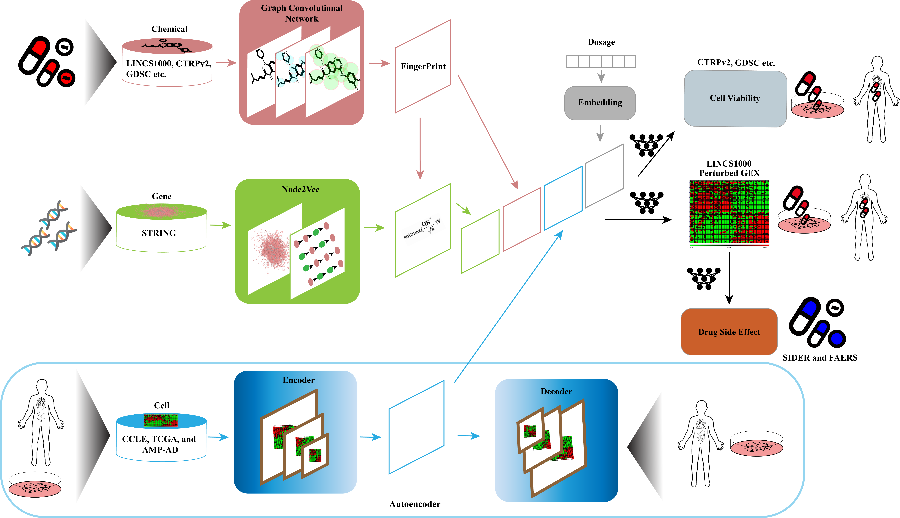

# MultiDCP: Predictive Modeling of Multiplex Chemical Phenomics for Novel Cells and Individual Patients: Application to Personalized Alzheimer’s Disease Drug Repurposing

MultiDCP is multi-tasks transfer learning based model. It is desiged to perform multiple tasks including dose-dependent chemical-induced differential gene expression predictions (chemical transcriptomics) and cell viability predictions for *de novo* drugs and *de novo* cell lines. This model includes four input components, a graph convolutional network based chemical fingerprint embedding module, a chemical substructure-gene interactions module, a knowledge-enabled autoencoder module and a dosage information embedding module (Figure 1). This superior performance is attributed to an innovative knowledge-enabled autoencoder for gene expression profiles, integration of multiple diverse labeled and unlabeled omics data, and the joint training of the multiple prediction tasks. We further apply MultiDCP to conduct drug repurposing for individual Alzheimer’s disease (AD) patients. The clinical potential of proposed drug leads on AD is supported by existing experimental and clinical evidence.



# Prerequisites
Linux

NVIDIA GPU is strongly recommended for speed. CPU is also supported but is slow.

# Docker installation
```
cd multidcp MultiDCP/script/docker_folder
docker build --network=host -t multidcp .
nvidia-docker run --name multidcp -it --privileged=true --network=host --rm -v /path/to/MultiDCP/:/workspace multidc
```

# Install required packages
```
cd multidcp MultiDCP/script/docker_folder
pip install -r ./requirements.txt
conda install --file ./conda_requirements.txt
```

# Reproducing experiments
1. Download data into MultiDCP/MultiDCP/data

[](https://doi.org/10.5281/zenodo.5172809)
```
pip install zenodo-get
zenodo_get 10.5281/zenodo.5172809
```

2. 
```
cd multidcp MultiDCP/script
./train_multidcp_ae.sh
```


